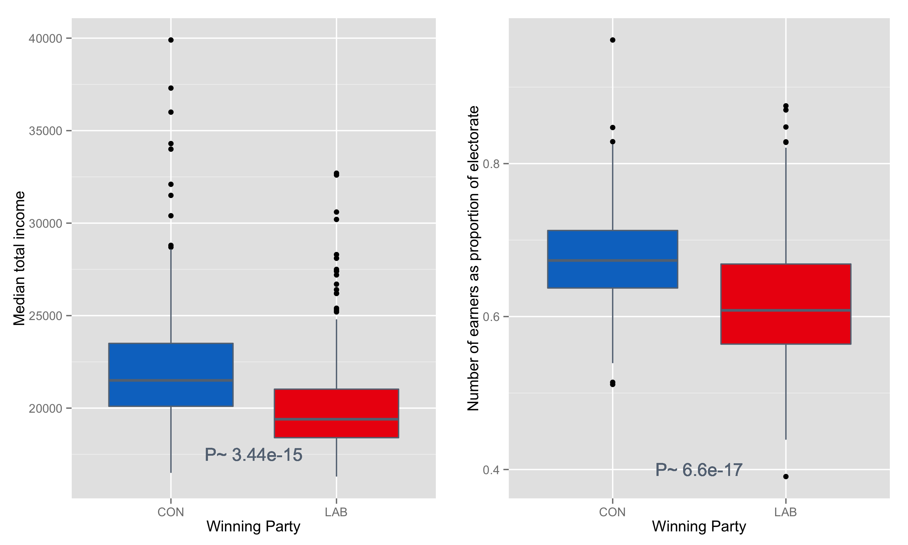
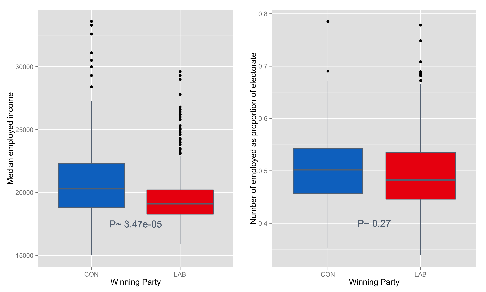
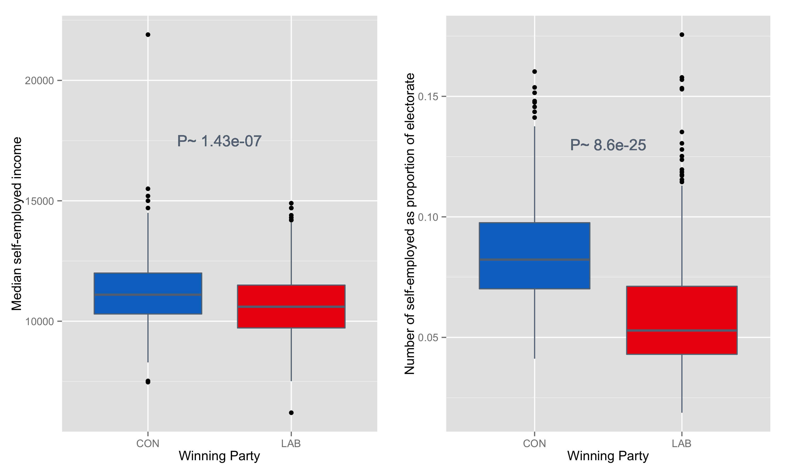
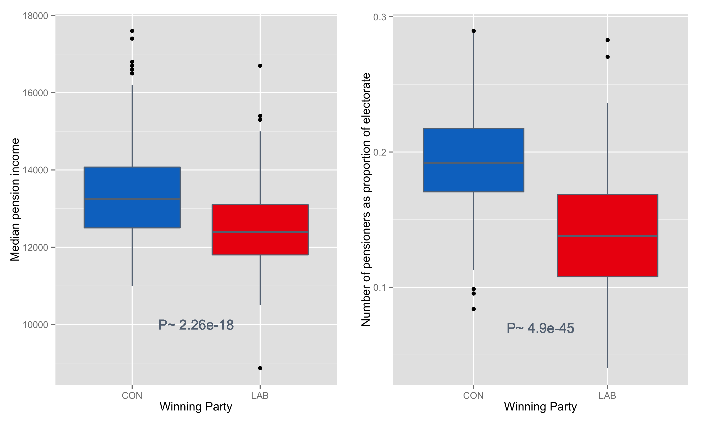
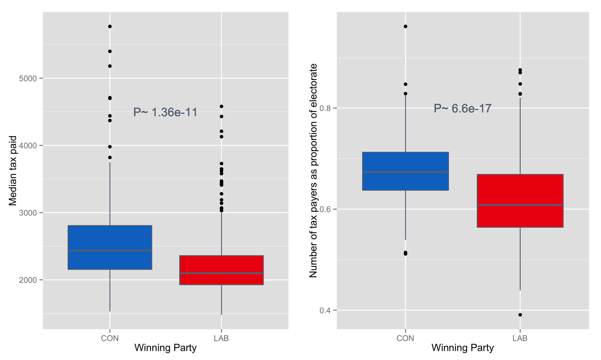

*Who* would vote for *them*?
==============================

The election of 2015 produced what many consider a shock result - a Conservative majority. Social media has been vitriolic in the aftermath and there has been talk of the ['shy Conservative'](https://en.wikipedia.org/wiki/Shy_Tory_Factor) who won't admit to voting Tory but turns out on the day - a mysterious figure that the left can't understand. The vitriol of the left is nothing new and it, in return, leads many to think ['who are these people that are so rabid?'](http://www.breitbart.com/london/2015/05/13/the-rise-of-the-socialist-justice-warriors/) So with this blog I look at '*who* would vote for *them*?'

I've previously [scraped the election results from the BBC website](https://randomlifedata.com/2015/09/corbyn-needs-swingers/) and the code to do so is available on [GitHub](https://github.com/randomlifedata/Election-2015-BBC-scraper) - the data pulled out will be available in the Git for this page along with the KnitR code for creating this blog - see end. I've merged that election data with [child poverty data from 2012](http://www.theguardian.com/news/datablog/2013/feb/20/uk-child-poverty-data-parliamentary-constituency) (from the Guardian, [as I did before](https://randomlifedata.com/2015/05/constituencies-higher-child-poverty-vote-labour/)) and [income and tax statistics from the ONS from 2013](https://www.gov.uk/government/uploads/system/uploads/attachment_data/file/406897/Table_3_15_13.xls) so that we can easily compare election preferences with economic status. I'm choosing economic status because it's the classic language of left vs right - and because I've already observed the correlation with child poverty and left/right voting.

<link rel='stylesheet' href=//cdnjs.cloudflare.com/ajax/libs/nvd3/1.1.15-beta/nv.d3.min.css>
<link rel='stylesheet' href=http://rawgithub.com/ramnathv/rCharts/master/inst/libraries/nvd3/css/rNVD3.css>

Child poverty and turnout
=========================

Starting again with child poverty but looking at a different graph this time - a scatter plot that shows the child poverty vs voter turnout for each constituency, with the winning party in 2015 shown by the colour of the data points. I've added the voter turnout because it correlates nicely with these poverty measures and because as I've said, [Labour will need to win over non-voters](https://randomlifedata.com/2015/09/corbyn-needs-swingers/) if they are to perform better in 2020. This is a javascript figure - hover over the data points for more info on which constituency is which, and you can zoom in by clicking and dragging to make a box over the area of interest.

<iframe src=' figure/interactive_nvd3chunk-1.html ' scrolling='no' frameBorder='0' seamless class='rChart highcharts ' id=iframe- chartc9bf27559201 ></iframe> 

It should hopefully be apparent that once again we can see greater success for Labour where there is greater child poverty. Conservative success is at the other end of the spectrum. The plot also indicates that voter turnout is inversely proportional to child poverty rates - perhaps indicating that disenfranchisement happens in worse-off societies. Interestingly, the third largest party this time, the SNP, has exceedingly high turnout but not the lowest levels of child poverty - they also don't have the highest levels of child poverty and so it seems like the nationalist groundswell was about something else. UKIP's one seat in Clacton has average turnout (64.3%) and fairly high child poverty (32.4%), perhaps indicating that the offer of an alternative was enough to re-engage supporters in that constituency.

Correlating vote share with child poverty
=========================================

<iframe src=' figure/corr3chunk-1.html ' scrolling='no' frameBorder='0' seamless class='rChart highcharts ' id=iframe- chartc9bfca5345e ></iframe> 

If we plot the share of votes for each party in each constituency against the child poverty in those constituencies, we can see that votes for Labour go up as child poverty goes up, and votes for Conservative go down as child poverty go up (the two parties cross over from 'top position' towards the right of the chart). UKIP seem to have a relatively consistent, low percentage regardless of child poverty and SNP have a high percentage (they won in almost every constituency they stood in) regardless of child poverty. 

Total income
============

Moving onto other economic status indicators, we can look at income statistics. These ought to be correlated with child poverty but may provide more detail on where such social problems stem from. Here I'll first look at total income, then break it down into employed, self-employed and pensioners. 

<iframe src=' figure/TotalIncome_chunk-1.html ' scrolling='no' frameBorder='0' seamless class='rChart highcharts ' id=iframe- chartc9bf7da1690f ></iframe> 

Looking at median income we can see that the differences are less pronounced than they are with child poverty. The zoom function on those plots is pretty handy in this case. Conservative constituencies do have higher income in general and SNP constituencies have a spread of incomes again suggesting that something else was going on in Scotland. 

From here I'm going to drill down into the main two parties, Labour and Conservative, so we can really understand '*who* would vote for *them*'. By pulling out only the constituencies that were won by Labour or Conservative, we can more clearly see the differences in these earnings categories. 

 

Above, the plot on the left shows that Conservatives constituents are significantly more likely to earn more than Labour constituents. An interesting addition to that is the plot on the right that shows Conservative constituents are more likely to be earners. The Conservative constituencies are generally better off it appears. The 'P-values' indicate significance of the differences between the two groups. They've been calculated with a simple t-test. 

*(for the stats geeks out there, no, I've not accounted for differences in variance or sample size and I've not tested that normality assumptions hold up. I've also not corrected for the multiple testing that is happening on this blog. I believe the results hold up regardless)*

Employed income 
===============

 

Looking at employed income only, we see still that Labour seats do have significantly lower income (left, significance p<<0.05) but it's interesting to note that Labour has the same proportion of people in employment (right hand plot). We know that Conservatives constituencies have more earners but it's not from those that work for someone else's company.

There has been a lot of rhetoric about [strivers and shirkers](http://www.theguardian.com/commentisfree/2012/oct/11/george-osborne-strivers-shock) but here we see that going by the most common type of work, Labour supporting constituencies have as many workers as Conservative constituencies - they just earn less. 

One thing that these statistics don't describe is the breakdown between part-time and full-time work so it's possible that Labour constituencies have more part-time workers, resulting in lower wages. That said, the stats also only include tax-payers and it's not clear whether part-time workers earning below the tax threshold would be included or not. So with these two uncertainties, I'm inclined to suggest taking it as a fair comparison but more work would firm up what's going on.  

Self-employed
=============

 

In the self-employed plots we can see that Conservative constituencies do have more self-employed people but although those self-employed people earn 'significantly more' (going by the t-test), the actual amount more (the effect size) is very small. 

What can be seen is that the earnings for self-employment are much smaller than for employment. That may be because many self-employed work part-time (again, we can't tell if they're included or not) or because self-employment is a thankless task. If low-earning part-time self employment was excluded due to not reaching the tax-threshold, then the higher numbers of self-employed might simply indicate a higher number of self-employed that earn enough to be taxed and then to be counted. The ONS doesn't state this information on their webpage!

Self-employment makes for interesting statistics because under the Conservatives the rise in employment has ["been predominantly amongst the self employed"](http://www.ons.gov.uk/ons/rel/lmac/self-employed-workers-in-the-uk/2014/rep-self-employed-workers-in-the-uk-2014.html) and there are now more self-employed people than ever before.

Pensioners
==========

 

Pensioners show similar patterns to the other two earners mentioned here - earning more in Conservative constituencies than in Labour ones. There are also more pensioners in Conservative constituencies - something that fits with the stereotype of Conservative voters. 

These three types of earner (employed,self-employed and pensioner) overlap and so their sum is always higher than the total number of earners that was first plotted. Breaking the total down into these three groups does help to highlight where the extra income comes from (employment and pensions). One thing that may play a part here is if some of the self-employed are also claiming a pension - the higher value pension would better augment the low self-employment earnings. Perhaps some of the extra motivation for self-employment comes from having had better earnings during employment and better pension as a result - or perhaps earning more throughout life (or having a partner that earns a decent wage) provides the capital needed for starting a business.

Total tax paid
==============

From the previous metrics, it might be tempting to say that Labour constituencies get a rough deal and that Conservative constituencies have a better standard of living from birth, through employment, into retirement. To investigate the other side of this, lets look at tax paid in each constituency. As it's quite an interesting metric, I'll return to the full plot to provide information on every constituency - mouse over the points to see which point is which constituency, click and drag to zoom in. 

<iframe src=' figure/taxchunk-1.html ' scrolling='no' frameBorder='0' seamless class='rChart highcharts ' id=iframe- chartc9bf4f6ce2ff ></iframe> 

As might be expected, this plot looks a lot like the one for total income: Conservatives to the right of the plot appear to pay more tax and they have higher voter turnout. One can't help wonder if the higher voter turnout is related to having a feeling of a greater stake in society - you earn more, you pay more tax, you want to have a say in government. Another way to look at it is that you feel like the system is working and so you are more inclined to take part in the system. Again, the SNP show a high turnout even though there is less obvious higher tax - their supporters may feel like the recent independence referendum showed they have a say in their society.

 

From this two party comparison, we can see that Conservative constituencies do pay more tax and have a higher number of tax payers than Labour constituencies. From that it might be understandable that a majority Conservative government wins on a rhetoric of cracking down on public expenditure and welfare payments. Conservative constituents are paying more towards the running of the country. 

Conclusion
==========

How to sum up all these graphs? It's apparent that voter turnout is related to economic status - with higher earners in successful communities turning out in higher numbers to vote for the system. It's apparent that those communities that are doing best are voting Conservative. And it's also apparent that those communities do contribute more to the public purse through direct taxation.

Taxation should be about redistributing wealth from prosperous parts of the country to raise up the worst-off parts. What we can see is that there is a definite trend of lower wages and pensions, higher child poverty and higher disenfranchisement in a large swathe of the country that is crying out for more support by voting for a party that is traditionally linked to greater redistribution - Labour's tax credits.

When we have such clear disparity from one constituency to the next it is troubling to see that the best off are supporting a party that stands on a platform of tax cuts and reduced welfare - those that are doing most well are against redistribution of wealth to those that need it most.

The worrying thing to me is how these problems seem to extend from cradle to grave - although these statistics don't prove anything about social mobility, it seems likely that a child born in poverty would earn less and retire on a smaller pension.  

Another 'them' that could be looked at here is the UKIP vote. Although I showed that UKIP vote share is not greatly linked to child poverty (correlation is around 0), there is a slight but significant correlation with UKIP vote share and income that indicates lower income leads to UKIP votes. Such a trend may indicate that UKIP is picking up support from areas that might traditionally vote Labour, rather than them coming from the Conservative supporter base as might be expected by comparing ideologies.

Supporting data and code
========================

* [Data can be found on FigShare](http://dx.doi.org/10.6084/m9.figshare.1559052)
* [KnitR markdown file can be found on GitHub](https://github.com/randomlifedata/Blog-Who-would-vote-for-them)
